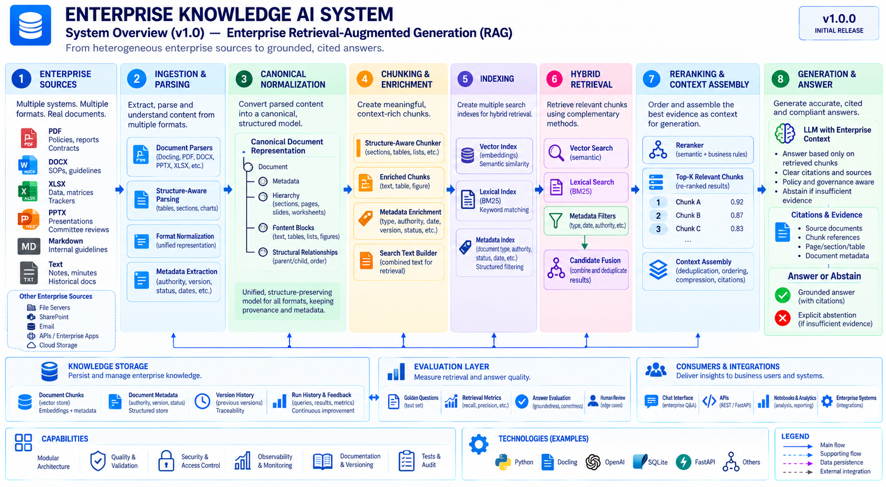

# Enterprise Knowledge AI System

🚀 **Current Stage:** Enterprise Retrieval Foundation\
🧪 **Validation:** Real semantic retrieval validated against enterprise
documents

The **Enterprise Knowledge AI System** is an Enterprise
Retrieval-Augmented Generation (RAG) system designed to transform
heterogeneous and fragmented corporate information into a trustworthy,
searchable, and evidence-grounded knowledge layer.

The project combines **multi-format ingestion, canonical normalization,
structure-aware chunking, semantic retrieval, enterprise metadata,
evidence traceability, governance, and systematic evaluation** to
support reliable AI-assisted access to organizational knowledge.

> **Evidence before generation. Retrieval quality before answer
> fluency.**

## Engineering Overview

The architecture separates **offline knowledge processing and indexing**
from **online retrieval and answer generation**. Enterprise documents
are parsed and normalized into a canonical representation, transformed
into structure-aware retrieval units, indexed for complementary
retrieval strategies, and used as controlled evidence for grounded
answers.

| Layer | Implementation / Direction |
|---|---|
| Enterprise Sources | PDF, DOCX, XLSX, PPTX, Markdown / Text |
| Parsing | Docling + specialized format parsers |
| Canonical Model | Structure-preserving document representation |
| Chunking | Structure-aware retrieval chunks |
| Search Text | Retrieval-oriented representation derived from chunks |
| Embeddings | OpenAI embeddings |
| Vector Retrieval | NumPy vector index + cosine similarity |
| Lexical Retrieval | BM25 — target architecture |
| Metadata Retrieval | Structured filters — target architecture |
| Fusion & Reranking | Hybrid candidate fusion + reranking — target architecture |
| Ground Truth | Canonical facts + document registry + golden questions |
| Evaluation | Retrieval, answer quality, citations, governance |
| Validation | Pytest + recorded real retrieval experiments |



The architecture overview represents the complete engineering direction
of the system. The **Current Status** section below distinguishes
implemented and validated capabilities from the remaining target
architecture.

## Trustworthy Enterprise RAG Principle

The system is designed around a simple responsibility chain:

``` text
Enterprise Knowledge
        ↓
Canonical Representation
        ↓
Structure-Aware Retrieval Units
        ↓
Search & Retrieval
        ↓
Evidence Ranking
        ↓
Controlled Context
        ↓
Grounded Generation
        ↓
Citations / Abstention
```

The central rule is:

> **Retrieve evidence → establish context → generate from evidence →
> cite the source → abstain when evidence is insufficient.**

The LLM is not treated as an enterprise system of record. The
architecture is designed to ground model behavior in retrieved
organizational evidence while preserving provenance, document authority,
structural context, and explicit limits.

## The Core Idea

> **Enterprise RAG is not primarily a generation problem. It is an
> evidence problem.**

Fluent answers are not sufficient if the system retrieves the wrong
document, ignores document authority, loses spreadsheet structure,
confuses current and obsolete information, or cannot prove where an
answer came from.

This project therefore treats retrieval, provenance, document structure,
evaluation, and governance as first-class architectural concerns rather
than secondary features around an LLM.

## System Overview

The engineering architecture above explains **how the system is
structured**. The visual below complements it with a product-level view
of the Enterprise Knowledge AI System and its role as a trustworthy
intelligence layer over heterogeneous corporate knowledge.


## Table of Contents

-   [Engineering Overview](#engineering-overview)
-   [Trustworthy Enterprise RAG
    Principle](#trustworthy-enterprise-rag-principle)
-   [The Core Idea](#the-core-idea)
-   [Overview](#overview)
-   [Current Status](#current-status)
-   [Enterprise Knowledge Sources](#enterprise-knowledge-sources)
-   [Canonical Document Model](#canonical-document-model)
-   [Structure-Aware Chunking](#structure-aware-chunking)
-   [Retrieval Architecture](#retrieval-architecture)
-   [Real-World Retrieval Validation](#real-world-retrieval-validation)
-   [Ground Truth & Evaluation](#ground-truth--evaluation)
-   [Governance & Traceability](#governance--traceability)
-   [Technology Stack](#technology-stack)
-   [Project Structure](#project-structure)
-   [Getting Started](#getting-started)
-   [Automated Tests](#automated-tests)
-   [Engineering Practices](#engineering-practices)
-   [Roadmap](#roadmap)
-   [Current Development Stage](#current-development-stage)
-   [Why This Project?](#why-this-project)
-   [License](#license)

## Overview

Organizations store critical knowledge across policies, procedures,
contracts, spreadsheets, presentations, incident reports, meeting
minutes, approval matrices, guidelines, and other disconnected sources.

The Enterprise Knowledge AI System is designed to ingest, organize,
retrieve, and ultimately synthesize that knowledge while preserving:

-   source traceability;
-   document authority;
-   version context;
-   structural relationships;
-   enterprise metadata;
-   supporting evidence;
-   explicit uncertainty and abstention behavior.

The objective is not to allow an LLM to answer from unsupported model
knowledge. The objective is to create an enterprise knowledge
architecture in which answers can be traced back to the evidence that
supports them.

### Core principles

-   **Evidence before generation**
-   **Retrieval quality before answer fluency**
-   **Source traceability**
-   **Document authority and version awareness**
-   **Structure preservation**
-   **Explicit handling of insufficient evidence**
-   **Deterministic controls where appropriate**
-   **AI where semantic interpretation adds value**
-   **Evaluation as part of the architecture**

## Current Status

The project has moved beyond architecture and dataset design into a
working **retrieval foundation** with real document processing and
semantic retrieval validation.

| Capability | Status |
|---|:---:|
| Enterprise corpus design | ✅ |
| PDF ingestion / parsing | ✅ |
| DOCX ingestion | ✅ |
| XLSX native parsing | ✅ |
| PPTX parsing / enrichment | ✅ |
| Markdown / text ingestion | ✅ |
| Canonical document representation | ✅ |
| Metadata preservation | ✅ |
| Structure-aware chunking | ✅ |
| Retrieval search-text construction | ✅ |
| OpenAI embeddings | ✅ |
| Vector indexing | ✅ |
| Single-document semantic retrieval | ✅ |
| Real retrieval smoke validation | ✅ |
| Ground-truth assets | ✅ |
| Retrieval validation log | ✅ |
| Global multi-document chunk identity | 🚧 |
| Multi-document vector retrieval | 🚧 |
| Lexical / BM25 retrieval | 📋 |
| Metadata filtering | 📋 |
| Candidate fusion | 📋 |
| Reranking | 📋 |
| Context assembly | 📋 |
| Grounded answer generation | 📋 |
| Citation validation | 📋 |
| Explicit answer abstention | 📋 |
| Systematic evaluation layer | 🚧 |

**Legend:** ✅ implemented / validated · 🚧 current or near-term
development · 📋 target architecture

## Enterprise Knowledge Sources

The system is intentionally designed for heterogeneous enterprise
information rather than a single document type.

Supported and modeled source formats include:

-   **PDF** --- policies, reports, contracts;
-   **DOCX** --- SOPs, guidelines, controlled documents;
-   **XLSX** --- operational data, approval matrices, trackers,
    formula-heavy workbooks;
-   **PPTX** --- presentations, committee reviews, structured slide
    content;
-   **Markdown / Text** --- internal guidelines, notes, historical
    documentation.

The controlled enterprise corpus also includes multiple document roles
such as policies, procedures, governance artifacts, meeting records,
matrices, reports, and operational documentation.

The corpus is synthetic and enterprise-inspired so that architecture and
retrieval behavior can be exercised without exposing confidential
corporate information.

## Canonical Document Model

Different file formats express structure differently. A spreadsheet is
not a PDF, a slide deck is not a Word document, and a table should not
be treated as an arbitrary paragraph.

The ingestion layer therefore converts heterogeneous source formats into
a **canonical, structure-preserving representation**.

Conceptually:

``` text
Source Document
      ↓
Format-Specific Parser
      ↓
Canonical Document
      ├── Document Metadata
      ├── Hierarchy
      ├── Content Blocks
      │     ├── Text
      │     ├── Tables
      │     ├── Lists
      │     └── Figures / structured elements
      └── Structural Relationships
            ├── parent / child
            └── document order
```

This boundary gives downstream components a common model while
preserving the meaning and provenance of the original source.

## Structure-Aware Chunking

The system does not treat chunking as arbitrary fixed-length text
slicing.

The **Structure-Aware Chunker** creates retrieval units that respect
document structure such as:

-   sections;
-   headings;
-   paragraphs;
-   lists;
-   tables;
-   worksheets;
-   slide boundaries;
-   structural relationships;
-   provenance metadata.

The goal is to create coherent units of knowledge that retain enough
context to be useful during retrieval without collapsing entire
documents into oversized retrieval units.

``` text
Canonical Document
        ↓
Structure-Aware Chunker
        ↓
Retrieval Chunks
        ↓
Search Text
        ↓
Indexing
```

Chunk identity and provenance are treated as engineering concerns
because retrieval results must remain traceable to the source document
and structural location from which they originated.

## Retrieval Architecture

The target retrieval architecture deliberately goes beyond pure vector
similarity.

``` text
User Question
      ↓
┌─────────────────────────────────┐
│ Complementary Retrieval Methods │
├─────────────────────────────────┤
│ Vector Search                   │
│ Lexical / BM25 Search           │
│ Metadata Filters                │
└─────────────────────────────────┘
      ↓
Candidate Fusion
      ↓
Reranking
      ↓
Top-K Evidence
      ↓
Context Assembly
```

### Vector retrieval

The implemented semantic retrieval foundation includes:

-   retrieval-oriented search text;
-   real OpenAI embeddings;
-   normalized embedding vectors;
-   a NumPy-backed vector index;
-   query embeddings;
-   exact cosine-similarity search;
-   ranked retrieval candidates.

Vector similarity is used for **ranking** and is not interpreted as a
percentage of relevance.

### Lexical retrieval

Lexical retrieval is part of the target architecture because exact
terminology, identifiers, policy names, codes, and enterprise vocabulary
can carry information that semantic similarity alone may not preserve
reliably.

### Metadata retrieval

Metadata-aware filtering is intended to support constraints such as:

-   document type;
-   authority;
-   status;
-   effective date;
-   version;
-   organizational scope;
-   source identity.

### Fusion and reranking

The target architecture combines complementary candidate sets and then
reranks them using richer contextual signals.

Potential reranking signals include:

-   relevance to the question;
-   document authority;
-   temporal validity;
-   metadata constraints;
-   structural context;
-   enterprise rules.

This separates broad candidate discovery from final evidence selection.

## Real-World Retrieval Validation

The project has completed its first recorded real semantic retrieval
validation.

### RV-001 --- Real Vector Retrieval / DOC-005

The experiment validated the following live path:

``` text
Enterprise PDF
      ↓
Docling Parser
      ↓
Canonical Normalization
      ↓
Canonical Blocks
      ↓
Structure-Aware Chunker
      ↓
Retrieval Chunks
      ↓
Search Text
      ↓
OpenAI Embeddings
      ↓
NumPy Vector Index
      ↓
Query Embedding
      ↓
Cosine Similarity
      ↓
Top-K Retrieval Candidates
```

The semantic query intentionally did not copy a section title directly.
The retrieval pipeline successfully ranked substantive policy evidence
above generic scope, purpose, and document-level context.

**Result: PASS**

This validates the technical integration of:

-   real enterprise PDF parsing;
-   canonical normalization;
-   structure-aware chunk creation;
-   real embedding generation;
-   vector indexing;
-   semantic query embedding;
-   cosine-similarity search;
-   ranked retrieval candidates.

The validation also identified an important engineering requirement:
document-local chunk identifiers must evolve into a globally unique
identity strategy before multi-document indexing is treated as robust.

That finding directly informs the next retrieval increment rather than
being hidden by a successful smoke test.

## Ground Truth & Evaluation

Evaluation is part of the architecture rather than a final cosmetic
test.

The controlled ground-truth layer includes:

``` text
data/ground_truth/
├── canonical_facts.yaml
├── document_registry.yaml
└── golden_questions.yaml
```

These assets provide a foundation for systematic evaluation of both
retrieval and generation.

### Evaluation model

``` text
Golden Question
      ↓
Expected Evidence / Canonical Facts
      ↓
System Execution
      ↓
┌─────────────────────────────────┐
│ Evaluation                      │
├─────────────────────────────────┤
│ Retrieval Quality               │
│ Answer Groundedness             │
│ Factual Correctness             │
│ Answer Relevance                │
│ Citation Correctness / Coverage │
│ Governance / Policy Compliance  │
└─────────────────────────────────┘
```

The system explicitly separates:

1.  **Retrieval quality** --- did the system find the correct evidence?
2.  **Generation quality** --- did the answer correctly use that
    evidence?

A fluent answer cannot compensate for failed retrieval.

### Planned retrieval metrics

The evaluation layer is designed to support metrics such as:

-   Hit Rate;
-   Recall@K;
-   Precision@K;
-   expected-evidence recovery;
-   ranking behavior against distractor documents.

### Planned answer evaluation

Generated answers will be evaluated for:

-   groundedness;
-   factual correctness;
-   answer relevance;
-   citation correctness;
-   citation coverage;
-   governance and policy compliance.

The intended approach is hybrid: deterministic validation against
canonical facts where possible, complemented by controlled probabilistic
/ LLM-as-a-Judge evaluation where semantic judgment adds value.

## Governance & Traceability

Enterprise knowledge systems require more than retrieval accuracy.

The architecture is designed to preserve:

-   source document identity;
-   document metadata;
-   authority;
-   version context;
-   effective dates and status;
-   chunk provenance;
-   page / section / worksheet / slide context where available;
-   evidence used by the answer;
-   evaluation history.

The target answer layer follows a controlled boundary:

``` text
Sufficient Evidence
      ↓
Grounded Answer
      +
Citations

Insufficient Evidence
      ↓
Explicit Abstention
```

The model should not compensate for missing enterprise evidence by
silently relying on unsupported prior knowledge.

## Technology Stack

  Category                 Technologies / Approach
  ------------------------ -----------------------------------------------
  Language                 Python 3.14
  Document Parsing         Docling + specialized parsers
  Spreadsheet Processing   openpyxl
  Embeddings               OpenAI
  Vector Search            NumPy + cosine similarity
  Ground Truth             YAML
  Testing                  pytest
  Documentation            Markdown
  Version Control          Git / GitHub
  Architecture             Modular, layered, evidence-first RAG
  Evaluation               Deterministic checks + planned LLM-as-a-Judge

Additional retrieval, API, persistence, orchestration, and frontend
technologies will be introduced only when required by a concrete
architectural capability.

## Project Structure

A simplified view of the repository:

``` text
enterprise-knowledge-ai-system/
├── app/
│   ├── ingestion/
│   ├── chunking/
│   ├── retrieval/
│   └── scripts/
│
├── data/
│   ├── source/
│   │   └── corporate_repository/
│   └── ground_truth/
│       ├── canonical_facts.yaml
│       ├── document_registry.yaml
│       └── golden_questions.yaml
│
├── docs/
│   ├── architecture/
│   ├── images/
│   ├── project_audit/
│   └── validation/
│
├── tests/
│   ├── unit/
│   ├── integration/
│   └── smoke/
│
├── README.md
├── requirements.txt
└── .gitignore
```

The detailed repository structure should be treated as implementation
documentation and may evolve as retrieval, evaluation, generation, and
application layers mature.

## Getting Started

### 1. Clone the repository

``` powershell
git clone <repository-url>
cd enterprise-knowledge-ai-system
```

### 2. Create and activate a virtual environment

``` powershell
python -m venv .venv
.\.venv\Scripts\Activate.ps1
```

### 3. Install dependencies

``` powershell
pip install -r requirements.txt
```

### 4. Configure external services when required

Real embedding calls require the appropriate environment configuration.

``` powershell
$env:OPENAI_API_KEY="your-api-key"
```

> **Security:** Never commit API keys, credentials, or other secrets to
> the repository.

### 5. Run the automated tests

``` powershell
python -m pytest
```

### 6. Generate the project audit

``` powershell
python -m app.scripts.project_audit
```

The audit provides a repository-derived engineering snapshot and helps
keep documentation aligned with the actual implementation.

## Automated Tests

The project uses **pytest** as a regression safety net across document
ingestion, canonical normalization, specialized parsing, chunking,
retrieval, and integration boundaries.

The test strategy intentionally separates:

``` text
Unit Tests
    ↓
Component correctness

Integration Tests
    ↓
Cross-layer behavior

Smoke / Real-Service Validation
    ↓
External integration and real retrieval behavior
```

Routine tests should remain deterministic and cost-efficient wherever
external model or embedding calls are not required.

Real-service experiments complement --- rather than replace ---
automated regression tests.

### Retrieval validation discipline

A successful smoke execution is not automatically considered
retrieval-quality evidence.

Meaningful retrieval validation records:

-   query;
-   corpus / source document;
-   configuration;
-   retrieved candidates;
-   ranking scores;
-   inspected evidence;
-   assessment;
-   architectural findings;
-   next validation step.

This creates an auditable progression from technical connectivity to
measurable retrieval quality.

## Engineering Practices

The project follows engineering practices intended to keep the system
explainable, testable, and extensible:

-   Layered Architecture
-   Modular Architecture
-   High Cohesion
-   Low Coupling
-   Separation of Concerns
-   Typed / explicit contracts where appropriate
-   Structure-preserving document processing
-   Deterministic controls where rules are sufficient
-   Semantic AI where interpretation adds material value
-   Evidence provenance
-   Automated Testing with pytest
-   Real-service validation separated from routine tests
-   Ground-truth-driven evaluation
-   Automated Project Audit
-   Incremental Delivery
-   Version Control
-   Documentation as an engineering artifact
-   Explicit distinction between implemented and target architecture

### Development principle

``` text
Implement Capability
      ↓
Run Targeted Tests
      ↓
Run Integration Validation
      ↓
Inspect Retrieval / Evidence Behavior
      ↓
Update Validation Record
      ↓
Run Project Audit
      ↓
Review Documentation
      ↓
Commit
```

The objective is not simply to make a pipeline execute. Each increment
should improve the system's ability to retrieve, preserve, evaluate, and
explain enterprise evidence reliably.

## Roadmap

### Current focus

**RV-002 --- Multi-document Vector Retrieval**

Before broad multi-document semantic retrieval is considered validated,
the project should:

1.  define and test globally unique retrieval-chunk identity;
2.  create retrieval chunks across multiple enterprise documents;
3.  index the combined corpus;
4.  execute semantic queries with relevant and distracting documents
    competing for ranking;
5.  evaluate whether the correct document and evidence are recovered in
    the Top-K.

### Retrieval evolution

``` text
Single-Document Vector Retrieval
              ↓
Multi-Document Vector Retrieval
              ↓
Lexical / BM25 Retrieval
              ↓
Metadata Filtering
              ↓
Candidate Fusion
              ↓
Reranking
              ↓
Context Assembly
```

### Answer and evaluation evolution

``` text
Retrieved Evidence
      ↓
Grounded Generation
      ↓
Citation Validation
      ↓
Answer / Abstention
      ↓
Systematic Evaluation
```

The roadmap is intentionally capability-driven. Additional
infrastructure should be introduced when it improves a concrete
retrieval, evaluation, governance, or product requirement rather than
merely increasing architectural complexity.

## Current Development Stage

The Enterprise Knowledge AI System has moved from conceptual
architecture into a working **enterprise retrieval engineering** stage.

The current implementation demonstrates that heterogeneous enterprise
documents can be parsed into a common structure, converted into
structure-aware retrieval units, embedded through a real external
embedding provider, indexed, and semantically retrieved with ranked
evidence.

The project is **not yet presented as a complete production RAG
application**. Multi-document retrieval hardening, hybrid retrieval,
reranking, context assembly, grounded generation, citation validation,
explicit abstention, and systematic evaluation remain active evolution
areas.

This distinction is intentional.

The portfolio objective is to demonstrate not only the final user
experience, but the engineering discipline required to build a
trustworthy enterprise knowledge system from the document and evidence
layers upward.

## Why This Project?

Enterprise AI is often demonstrated as a conversational interface
connected to documents.

This project explores the harder engineering problem underneath that
interface:

> **How do we transform heterogeneous enterprise information into
> evidence that an AI system can retrieve, understand, cite, evaluate,
> and trust?**

The repository therefore demonstrates capabilities across:

-   Enterprise AI architecture;
-   Retrieval-Augmented Generation;
-   document intelligence;
-   information retrieval;
-   data and metadata modeling;
-   software engineering;
-   evaluation engineering;
-   governance and traceability;
-   LLM integration;
-   enterprise knowledge management.

Together with the broader portfolio, the project represents a different
AI architecture problem:

-   **AI Supply Chain Copilot** --- deterministic analytics + Generative
    AI for decision intelligence;
-   **My LinkedIn Agentic AI System** --- bounded agentic
    orchestration + Human-in-the-Loop authority;
-   **Enterprise Knowledge AI System** --- evidence-centered enterprise
    retrieval + grounded knowledge.

The common engineering principle across the portfolio is to assign each
responsibility to the component best suited to perform it rather than
delegating every problem to an LLM.

## License

This repository is intended for educational, engineering, and portfolio
purposes.

The enterprise corpus and business scenarios are synthetic or fictional
and are designed to demonstrate realistic architecture and retrieval
behavior without exposing confidential corporate information.
